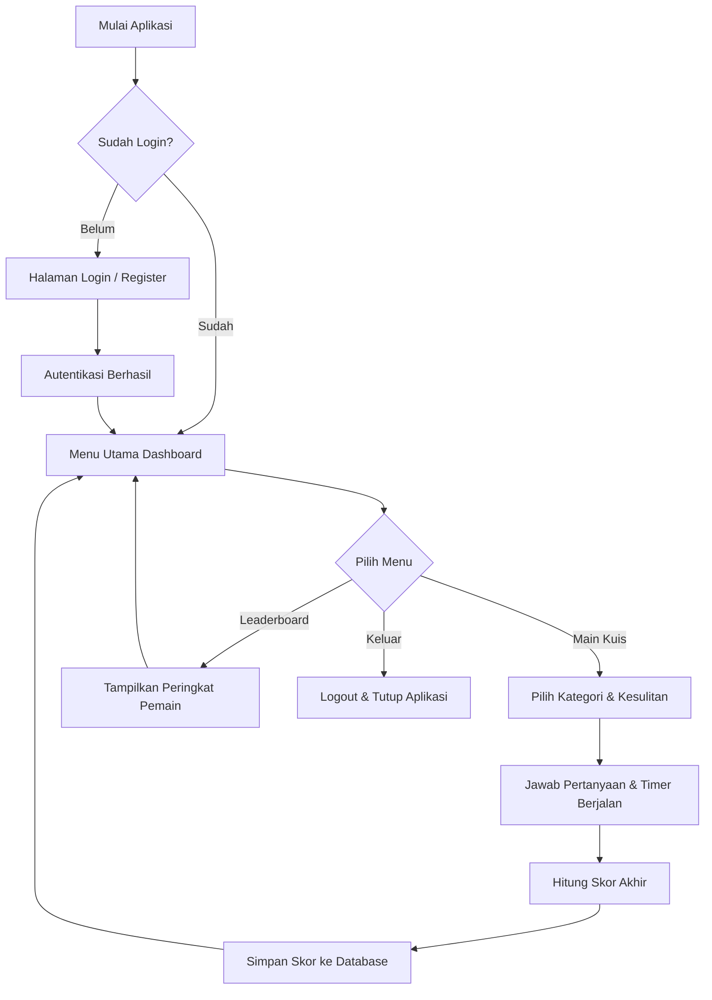
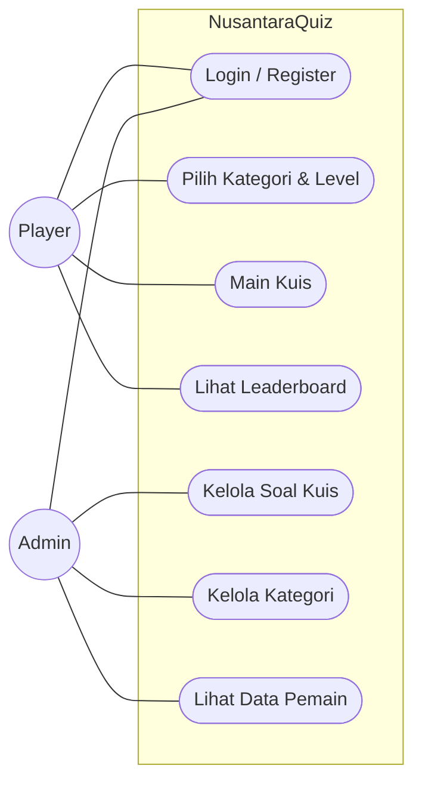
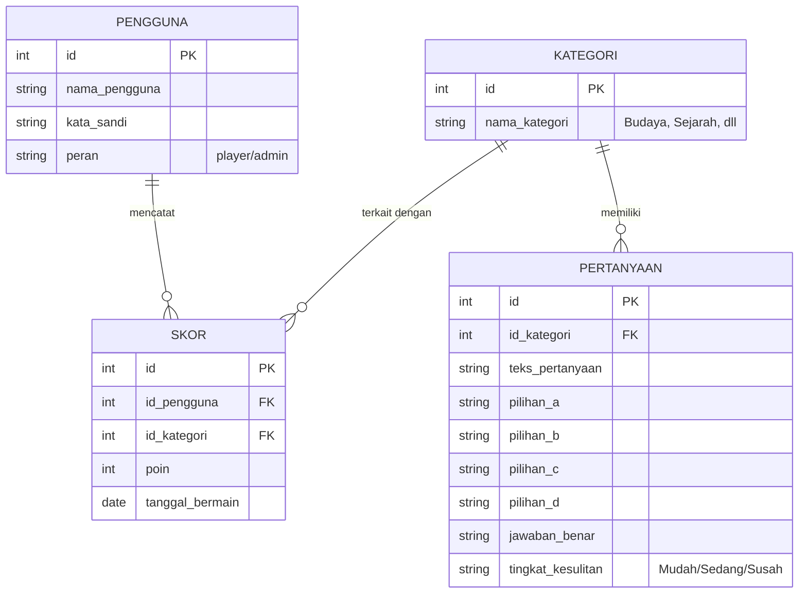

# Presentasi Praktikum Minggu 1: Perancangan Sistem (Desain Awal)
## Project: NusantaraQuiz (Android)

---

## 1. User Requirement

**Catatan Presentasi / Penjelasan:**
> *Pada bagian pertama, kami menentukan kebutuhan sistem dari sudut pandang pengguna. Aplikasi NusantaraQuiz memiliki 2 role utama: **Player** (Pemain) dan **Admin**.*
> * **Player** bertugas sebagai end-user yang bisa mendaftar, login, memilih kategori dan tingkat kesulitan, lalu memainkan kuis. Mereka juga bisa melihat papan peringkat (leaderboard). Batasannya, Player hanya bisa mengkonsumsi konten (menjawab kuis) dan melihat skor.
> * **Admin** bertugas di balik layar. Admin memiliki akses login khusus untuk mengelola sistem. Fitur utamanya adalah CRUD (Create, Read, Update, Delete) untuk soal kuis dan kategori, serta memantau data pemain. Admin tidak ikut bermain kuis.

**Deskripsi Sistem:**
NusantaraQuiz adalah aplikasi game kuis edukatif berbasis Android yang menyajikan pertanyaan seputar budaya, sejarah, dan pengetahuan umum Indonesia. Aplikasi ini memiliki fitur poin, timer, leaderboard, serta tingkat kesulitan yang bervariasi.

**Identifikasi Role:**
Terdapat 2 role utama dalam aplikasi ini:
1. **Player (Pemain):** Pengguna yang memainkan kuis.
2. **Admin:** Pengelola konten kuis dan data sistem.

**Kebutuhan/Fitur Masing-Masing Role:**
*   **Player:**
    *   Mendaftar (Register) dan Masuk (Login) ke dalam aplikasi.
    *   Memilih kategori kuis (Budaya, Sejarah, Bahasa, dll).
    *   Memilih tingkat kesulitan (Mudah, Sedang, Susah).
    *   Memainkan kuis dengan sistem timer dan skor.
    *   Melihat Leaderboard (Papan Peringkat).
*   **Admin:**
    *   Masuk (Login) khusus Admin.
    *   Mengelola (Tambah, Edit, Hapus) soal kuis.
    *   Mengelola kategori kuis.
    *   Melihat data statistik pemain.

**Batasan Akses Tiap Role:**
*   **Player:** Hanya bisa membaca soal (memainkan kuis) dan melihat skor sendiri serta skor publik di leaderboard. Tidak dapat mengedit pertanyaan atau menghapus akun pengguna lain.
*   **Admin:** Memiliki akses penuh terhadap manajemen konten (CRUD soal kuis dan kategori), namun tidak ikut bermain untuk masuk ke dalam leaderboard.

---

## 2. Flowchart Alur Utama Aplikasi

**Catatan Presentasi / Penjelasan:**
> *Untuk alur aplikasinya (Flowchart), kami merancangnya dengan alur yang sederhana namun efektif.*
> * *Saat aplikasi pertama kali dibuka, sistem akan mengecek apakah pengguna sudah login atau belum. Jika belum, mereka diwajibkan melewati halaman Login/Register.* 
> * *Setelah berhasil masuk ke Dashboard Utama, pengguna dihadapkan pada menu percabangan:*
>   * *Jika memilih **Main Kuis**: Pengguna memilih kategori dan kesulitan, menjawab pertanyaan dengan timer berjalan, dan di akhir permainan sistem akan menghitung skor lalu menyimpannya ke database.*
>   * *Jika memilih **Leaderboard**: Sistem akan menampilkan peringkat.*
>   * *Jika memilih **Keluar**: Sesi berakhir dan aplikasi ditutup.*

---

## 3. Use Case Diagram

**Catatan Presentasi / Penjelasan:**
> *Pada Use Case Diagram, kami memvisualisasikan interaksi antara Aktor (Player & Admin) dengan sistem (NusantaraQuiz). Dari gambar ini terlihat jelas pembagian hak aksesnya:*
> * *Player dan Admin sama-sama bisa mengakses fitur **Login/Register**.*
> * *Hanya **Player** yang bisa mengakses Use Case bermain seperti: Pilih Kategori, Main Kuis, dan Lihat Leaderboard.*
> * *Sebaliknya, hanya **Admin** yang memiliki akses ke fitur manajemen (Kelola Soal, Kelola Kategori, dan Lihat Data Pemain).*

---

## 4. Database Design (ERD Sederhana)

**Catatan Presentasi / Penjelasan:**
> *Terakhir, untuk menyimpan data, kami merancang Database dengan 4 tabel utama:*
> 1. ***Tabel PENGGUNA**: Menyimpan akun untuk login (menyimpan id, nama_pengguna, kata_sandi, dan peran apakah dia Admin atau Player).*
> 2. ***Tabel KATEGORI**: Menyimpan nama-nama topik kuis (seperti Budaya, Sejarah, dsb).*
> 3. ***Tabel PERTANYAAN**: Ini adalah bank soal kita. Tabel ini berelasi dengan tabel Kategori, sehingga kita tahu soal ini masuk ke kategori apa. Di dalamnya ada teks soal, opsi A sampai D, jawaban yang benar, dan tingkat kesulitan.*
> 4. ***Tabel SKOR**: Berfungsi untuk riwayat poin. Tabel ini berelasi dengan tabel Pengguna (siapa yang main) dan tabel Kategori (kategori apa yang dimainkan), beserta jumlah poin yang didapat.*
> 
> *Relasinya adalah: Satu Pengguna bisa memiliki banyak Skor, Satu Kategori bisa memiliki banyak Pertanyaan, dan Satu Kategori juga bisa terhubung dengan banyak riwayat Skor.*

Terdapat 4 tabel utama: `PENGGUNA`, `KATEGORI`, `PERTANYAAN`, dan `SKOR`.

